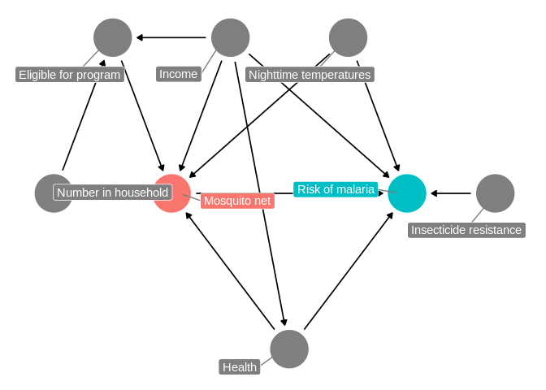

Matching and Inverse Probability Weighting
================

### 1. Program background

Researchers are interested in whether using mosquito nets decreases an
individual’s risk of contracting malaria. They have collected data from
1, 752 households in an unnamed country and have variables related to
environmental factors, individual health, and household characteristics.

The data is **not experimental**—researchers have no control over who
uses mosquito nets, and individual households make their own choices
over whether to apply for free nets or buy their own nets, as well as
whether they use the nets if they have them.

The CSV file contains the following columns:

-   Malaria risk (`malaria_risk`): The likelihood that someone in the
    household will be infected with malaria. Measured on a scale of
    0–100, with higher values indicating higher risk.

-   Mosquito net (`net` and `net_num`): A binary variable indicating if
    the household used mosquito nets.

-   Eligible for program (`eligible`): A binary variable indicating if
    the household is eligible for the free net program.

-   Income (`income`): The household’s monthly income, in US dollars.

-   Nighttime temperatures (`temperature`): The average temperature at
    night, in Celsius.

-   Health (`health`): Self-reported healthiness in the household.
    Measured on a scale of 0–100, with higher values indicating better
    health.

-   Number in household (`household`): Number of people living in the
    household.

-   Insecticide resistance (`resistance`): Some strains of mosquitoes
    are more resistant to insecticide and thus pose a higher risk of
    infecting people with malaria. This is measured on a scale of 0–100,
    with higher values indicating higher resistance.

**Our goal is to estimate the *causal* effect of bed net usage on
malaria risk using only observational data**. This was not an RCT, so it
might seem a little sketchy to make claims of causality. But if we can
draw a correct DAG and adjust for the correct nodes, we can isolate the
net → malaria relationship and talk about causality.

``` r
nets <- read_csv("data/mosquito_nets.csv")
```

### 2. DAG and adjustment sets

Before running any models, we need to find what we need to adjust for.

``` r
mosquito_dag <- dagify(
  malaria_risk ~ net + income + health + temperature + resistance,
  net ~ income + health + temperature + eligible + household,
  eligible ~ income + household,
  health ~ income,
  exposure = "net",
  outcome = "malaria_risk",
  coords = list(x = c(malaria_risk = 7, net = 3, income = 4, health = 5,
                      temperature = 6, resistance = 8.5, eligible = 2, household = 1),
                y = c(malaria_risk = 2, net = 2, income = 3, health = 1,
                      temperature = 3, resistance = 2, eligible = 3, household = 2)),
  labels = c(malaria_risk = "Risk of malaria", net = "Mosquito net", income = "Income",
             health = "Health", temperature = "Nighttime temperatures",
             resistance = "Insecticide resistance",
             eligible = "Eligible for program", household = "Number in household")
)

ggdag_status(mosquito_dag, use_labels = "label", text = FALSE) +
  guides(fill = FALSE, color = FALSE) +  # Disable the legend
  theme_dag()
```

<!-- -->

Following the logic of do-calculus, we can find all the nodes that
confound the relationship between net usage and malaria risk, since
those nodes open up backdoor paths and distort the causal effect we care
about. We can either do this graphically by looking for any node that
points to both net and malaria risk, or we can use R:

``` r
adjustmentSets(mosquito_dag)
```

    { health, income, temperature }

From the list above, adjusting for health, income, and temperature is
enough to close all backdoors and identify the relationship between net
use and malaria risk.

### 3. Naive correlation-isn’t-causation estimate

We can start by calculating the difference in average malaria risk for
those who did / didn’t use mosquito nets. This is not the actual causal
effect but the “correlation is not causation” effect which doesn’t
account for any of the backdoors in the DAG.

We can do this with a table, or with a linear regression model.

``` r
tab <- nets %>% 
        group_by(net) %>% 
        summarize(number = n(),
                  avg = mean(malaria_risk))
tab
```

    # A tibble: 2 x 3
      net   number   avg
      <lgl>  <int> <dbl>
    1 FALSE   1071  41.9
    2 TRUE     681  25.6

``` r
abs(tab[1,3] - tab[2,3])
```

           avg
    1 16.33152

``` r
model_wrong <- lm(malaria_risk ~ net, data = nets)
tidy(model_wrong)
```

    # A tibble: 2 x 5
      term        estimate std.error statistic   p.value
      <chr>          <dbl>     <dbl>     <dbl>     <dbl>
    1 (Intercept)     41.9     0.405     104.  0.       
    2 netTRUE        -16.3     0.649     -25.1 2.25e-119

According to this estimate, usage of a mosquito net decreases the risk
of getting malaria by 16 points. We can’t legally talk about this as a
causal effect though—there are confounding variables to deal with.

### 4. Matching

We can use matching techniques to pair up similar observations and make
the unconfoundedness assumption—that if we see two observations that are
pretty much identical, and one used a net and one didn’t, the choice to
use a net was random.

Because we know from the DAG that income, nighttime temperatures, and
health help cause both net use and malaria risk (and confound that
relationship!), we’ll try to find observations with similar values of
income, temperatures, and health that both used and didn’t use nets.

We can use the matchit() function from the
[MatchIt](https://kosukeimai.github.io/MatchIt/index.html) R package to
match points based on Mahalanobis distance.

We can include the `replace = TRUE` option to make it so that points
that have been matched already can be matched again (that is, we’re not
forcing a one-to-one matching; we have one-to-many matching instead).

#### 4.1 Preprocess

``` r
matched_data <- matchit(net ~ income + temperature + health,
                        data = nets,
                        method = "nearest",
                        distance = "mahalanobis",
                        replace = TRUE)
summary(matched_data)
```


    Call:
    matchit(formula = net ~ income + temperature + health, data = nets, 
        method = "nearest", distance = "mahalanobis", replace = TRUE)

    Summary of Balance for All Data:
                Means Treated Means Control Std. Mean Diff. Var. Ratio eCDF Mean
    income           955.1938      872.7526          0.4089     1.3633    0.1044
    temperature       23.3809       24.0880         -0.1685     1.0846    0.0424
    health            54.9090       48.0570          0.3619     1.2083    0.0714
                eCDF Max
    income        0.1983
    temperature   0.0972
    health        0.1683


    Summary of Balance for Matched Data:
                Means Treated Means Control Std. Mean Diff. Var. Ratio eCDF Mean
    income           955.1938      950.0191          0.0257     1.1108    0.0096
    temperature       23.3809       23.4081         -0.0065     1.0321    0.0069
    health            54.9090       54.5301          0.0200     1.0758    0.0074
                eCDF Max Std. Pair Dist.
    income        0.0485          0.1226
    temperature   0.0279          0.1188
    health        0.0279          0.1255

    Percent Balance Improvement:
                Std. Mean Diff. Var. Ratio eCDF Mean eCDF Max
    income                 93.7       66.1      90.8     75.6
    temperature            96.2       61.0      83.7     71.3
    health                 94.5       61.4      89.6     83.4

    Sample Sizes:
                  Control Treated
    All           1071.       681
    Matched (ESS)  323.18     681
    Matched        439.       681
    Unmatched      632.         0
    Discarded        0.         0

Here we can see that all 681 of the net users were paired with
similar-looking non-users (439 of them). 632 people weren’t matched and
will get discarded.

To which treated rows got matched to which control rows, run the code
below:

``` r
head(matched_data$match.matrix)
```

       [,1]  
    1  "921" 
    4  "795" 
    7  "1034"
    12 "772" 
    13 "539" 
    16 "715" 

We can create a new data frame of those matches with `match.data()`.
This dataset should have (1752 - 632 = 1120) observations.

``` r
matched_data_for_real <- match.data(matched_data)
```

#### 4.2 Check whether the balance was effective.

``` r
t.test(income ~ net, data = matched_data_for_real)
```


        Welch Two Sample t-test

    data:  income by net
    t = -3.5017, df = 990.87, p-value = 0.0004829
    alternative hypothesis: true difference in means is not equal to 0
    95 percent confidence interval:
     -64.12955 -18.06677
    sample estimates:
    mean in group FALSE  mean in group TRUE 
               914.0957            955.1938 

``` r
t.test(temperature ~ net, data = matched_data_for_real)
```


        Welch Two Sample t-test

    data:  temperature by net
    t = 0.79239, df = 952.76, p-value = 0.4283
    alternative hypothesis: true difference in means is not equal to 0
    95 percent confidence interval:
     -0.2955968  0.6959627
    sample estimates:
    mean in group FALSE  mean in group TRUE 
               23.58109            23.38091 

``` r
t.test(health ~ net, data = matched_data_for_real)
```


        Welch Two Sample t-test

    data:  health by net
    t = -3.0287, df = 977.39, p-value = 0.002521
    alternative hypothesis: true difference in means is not equal to 0
    95 percent confidence interval:
     -5.567087 -1.189325
    sample estimates:
    mean in group FALSE  mean in group TRUE 
               51.53075            54.90896 

#### 4.3 Estimation

Now that the data has been matched, it should work better for modeling.
Also, because we used income, temperatures, and health in the matching
process, we’ve adjusted for those DAG nodes and have closed those
backdoors, so our model can be pretty simple here:

``` r
model_matched <- lm(malaria_risk ~ net,
                    data = matched_data_for_real)
tidy(model_matched)
```

    # A tibble: 2 x 5
      term        estimate std.error statistic  p.value
      <chr>          <dbl>     <dbl>     <dbl>    <dbl>
    1 (Intercept)     38.5     0.600      64.2 0.      
    2 netTRUE        -12.9     0.769     -16.8 2.31e-56

The 12.88 point decrease here is better than the naive estimate, but
it’s not the true 10 point causal effect (that the trainer built in to
the data). Perhaps that’s because the matches aren’t great, or maybe we
threw away too much data. There are a host of diagnostics you can look
at to see how well things are matched (check the documentation for
MatchIt for examples.)

Actually, the most likely culprit for the incorrect estimate is that
there’s some imbalance in the data. Because we set `replace = TRUE`, we
did not do 1:1 matching—untreated observations were paired with more
than one treated observation. As a result, the multiply-matched
observations are getting overcounted and have too much importance in the
model. Fortunately, matchit() provides us with a column called
**weights** that allows us to scale down the overmatched observations
when running the model. Importantly, these weights have nothing to do
with causal inference or backdoors or inverse probability
weighting—their only purpose is to help scale down the imbalance arising
from overmatching. If you use `replace = FALSE` and enforce 1:1
matching, the whole weights column will just be 1.

``` r
model_matched_wts <- lm(malaria_risk ~ net,
                        data = matched_data_for_real,
                        weights = weights)
tidy(model_matched_wts)
```

    # A tibble: 2 x 5
      term        estimate std.error statistic  p.value
      <chr>          <dbl>     <dbl>     <dbl>    <dbl>
    1 (Intercept)     36.1     0.595      60.6 0.      
    2 netTRUE        -10.5     0.763     -13.7 7.98e-40

After weighting to account for under- and over-matching, we find a
-10.49 point causal effect. That’s much better than any of the other
estimates we’ve tried so far! The reason it’s accurate is because we’ve
closed the confounding backdoors and isolated the arrow between net use
and malaria risk.

### 5. Inverse Probability Weighting

One potential downside to matching is that you generally have to throw
away a sizable chunk of your data—anything that’s unmatched doesn’t get
included in the final matched data.

An alternative approach to matching is to assign every observation some
probability of receiving treatment, and then weight each observation by
its inverse probability—observations that are predicted to get treatment
and then don’t, or observations that are predicted to not get treatment
and then do will receive more weight than the observations that
get/don’t get treatment as predicted.

Generating these inverse probability weights requires a two step
process: (1) we first generate propensity scores, or the probability of
receiving treatment, and then (2) we use a special formula to convert
those propensity scores into weights. Once we have inverse probability
weights weights, we can incorporate them into our regression model.

#### 5.1 Generate propensity scores

``` r
model_net <- glm(net ~ income + temperature + health,
                   data = nets,
                   family = binomial(link = "logit"))
```

We can then plug in the income, temperatures, and health for every row
in our dataset and generate a predicted probability using this model:

``` r
# augment_columns() handles the plugging in of values. You need to feed it the
# name of the model and the name of the dataset you want to add the predictions
# to. The type.predict = "response" argument makes it so the predictions are in
# the 0-1 scale. If you don't include that, you'll get predictions in an
# uninterpretable log odds scale.
net_probabilities <- augment_columns(model_net,
                                     nets,
                                     type.predict = "response") %>%
  # The predictions are in a column named ".fitted", so we rename it here
  rename(propensity = .fitted)


# Look at the first few rows of a few columns
net_probabilities %>%
  select(id, net, income, temperature, health, propensity) %>%
  head()
```

    # A tibble: 6 x 6
         id net   income temperature health propensity
      <dbl> <lgl>  <dbl>       <dbl>  <dbl>      <dbl>
    1     1 TRUE     781        21.1     56      0.367
    2     2 FALSE    974        26.5     57      0.389
    3     3 FALSE    502        25.6     15      0.158
    4     4 TRUE     671        21.3     20      0.263
    5     5 FALSE    728        19.2     17      0.308
    6     6 FALSE   1050        25.3     48      0.429

Next we need to convert those propensity scores into inverse probability
weights, which makes weird observations more important (i.e. people who
had a high probability of using a net but didn’t, and vice versa). To do
this, we follow this equation:
$$\\frac{Treatment}{Propensity} - \\frac{1-Treatment}{1-Propensity}$$
This equation will create weights that provide the average treatment
effect (ATE)

``` r
net_ipw <- net_probabilities %>%
  mutate(ipw = (net_num / propensity) + ((1 - net_num) / (1 - propensity)))

# Look at the first few rows of a few columns
net_ipw %>%
  select(id, net, income, temperature, health, propensity, ipw) %>%
  head()
```

    # A tibble: 6 x 7
         id net   income temperature health propensity   ipw
      <dbl> <lgl>  <dbl>       <dbl>  <dbl>      <dbl> <dbl>
    1     1 TRUE     781        21.1     56      0.367  2.72
    2     2 FALSE    974        26.5     57      0.389  1.64
    3     3 FALSE    502        25.6     15      0.158  1.19
    4     4 TRUE     671        21.3     20      0.263  3.81
    5     5 FALSE    728        19.2     17      0.308  1.44
    6     6 FALSE   1050        25.3     48      0.429  1.75

These first few rows have fairly low weights—those with low
probabilities of using nets didn’t, while those with high probabilities
did. But look at person 4! They only had a 26% chance of using a net and
they did! That’s weird! They therefore have a higher inverse probability
weight

#### 5.2 Estimation

Now that we’ve generated inverse probability weights based on our
confounders, we can run a model to find the causal effect of mosquito
net usage on malaria risk. Again, we don’t need to include income,
temperatures, or health in the model since we already used them when we
created the propensity scores and weights:

``` r
model_ipw <- lm(malaria_risk ~ net,data = net_ipw,weights = ipw)

tidy(model_ipw)
```

    # A tibble: 2 x 5
      term        estimate std.error statistic  p.value
      <chr>          <dbl>     <dbl>     <dbl>    <dbl>
    1 (Intercept)     39.7     0.468      84.7 0.      
    2 netTRUE        -10.1     0.658     -15.4 3.21e-50

### 6. Results from all the models

``` r
modelsummary(list("Naive" = model_wrong,
                  "Matched" = model_matched, "Matched + weights" = model_matched_wts,
                  "IPW" = model_ipw))
```

<table class="table" style="width: auto !important; margin-left: auto; margin-right: auto;">
<thead>
<tr>
<th style="text-align:left;">
</th>
<th style="text-align:center;">
Naive
</th>
<th style="text-align:center;">
Matched
</th>
<th style="text-align:center;">
Matched + weights
</th>
<th style="text-align:center;">
IPW
</th>
</tr>
</thead>
<tbody>
<tr>
<td style="text-align:left;">
(Intercept)
</td>
<td style="text-align:center;">
41.937
</td>
<td style="text-align:center;">
38.487
</td>
<td style="text-align:center;">
36.094
</td>
<td style="text-align:center;">
39.679
</td>
</tr>
<tr>
<td style="text-align:left;">
</td>
<td style="text-align:center;">
(0.405)
</td>
<td style="text-align:center;">
(0.600)
</td>
<td style="text-align:center;">
(0.595)
</td>
<td style="text-align:center;">
(0.468)
</td>
</tr>
<tr>
<td style="text-align:left;">
netTRUE
</td>
<td style="text-align:center;">
-16.332
</td>
<td style="text-align:center;">
-12.882
</td>
<td style="text-align:center;">
-10.489
</td>
<td style="text-align:center;">
-10.131
</td>
</tr>
<tr>
<td style="text-align:left;box-shadow: 0px 1px">
</td>
<td style="text-align:center;box-shadow: 0px 1px">
(0.649)
</td>
<td style="text-align:center;box-shadow: 0px 1px">
(0.769)
</td>
<td style="text-align:center;box-shadow: 0px 1px">
(0.763)
</td>
<td style="text-align:center;box-shadow: 0px 1px">
(0.658)
</td>
</tr>
<tr>
<td style="text-align:left;">
Num.Obs.
</td>
<td style="text-align:center;">
1752
</td>
<td style="text-align:center;">
1120
</td>
<td style="text-align:center;">
1120
</td>
<td style="text-align:center;">
1752
</td>
</tr>
<tr>
<td style="text-align:left;">
R2
</td>
<td style="text-align:center;">
0.265
</td>
<td style="text-align:center;">
0.201
</td>
<td style="text-align:center;">
0.145
</td>
<td style="text-align:center;">
0.119
</td>
</tr>
<tr>
<td style="text-align:left;">
R2 Adj.
</td>
<td style="text-align:center;">
0.265
</td>
<td style="text-align:center;">
0.200
</td>
<td style="text-align:center;">
0.144
</td>
<td style="text-align:center;">
0.119
</td>
</tr>
<tr>
<td style="text-align:left;">
AIC
</td>
<td style="text-align:center;">
14030.7
</td>
<td style="text-align:center;">
8851.7
</td>
<td style="text-align:center;">
8890.0
</td>
<td style="text-align:center;">
14274.3
</td>
</tr>
<tr>
<td style="text-align:left;">
BIC
</td>
<td style="text-align:center;">
14047.1
</td>
<td style="text-align:center;">
8866.8
</td>
<td style="text-align:center;">
8905.0
</td>
<td style="text-align:center;">
14290.7
</td>
</tr>
<tr>
<td style="text-align:left;">
Log.Lik.
</td>
<td style="text-align:center;">
-7012.326
</td>
<td style="text-align:center;">
-4422.846
</td>
<td style="text-align:center;">
-4441.978
</td>
<td style="text-align:center;">
-7134.172
</td>
</tr>
<tr>
<td style="text-align:left;">
F
</td>
<td style="text-align:center;">
632.315
</td>
<td style="text-align:center;">
280.581
</td>
<td style="text-align:center;">
188.862
</td>
<td style="text-align:center;">
236.841
</td>
</tr>
</tbody>
</table>

Because this is fake simulated data where the trainer built in a 10
point effect, we can see which of these models gets the closest: here,
the non-truncated IPW model wins.

Both matching and IPW work well for closing backdoors and adjusting for
confounders. In real life, you won’t know the true value, so try
multiple ways.
