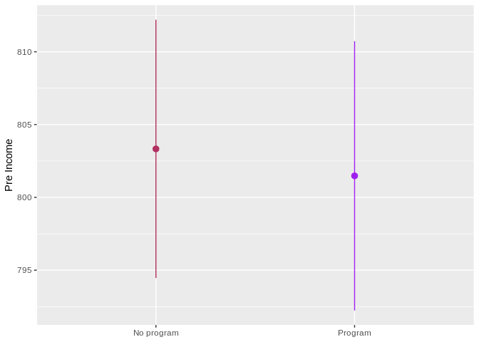

Randomization and Matching
================

### Program details

In this hypothetical situation, an NGO is planning on launching a
training program designed to boost incomes. Based on their experiences
in running pilot programs in other countries, they’ve found that older,
richer men tend to self-select into the training program. The NGO’s
evaluation consultant (you!) drew this causal model explaining the
effect of the program on participant incomes, given the confounding
caused by age, sex, and prior income:

``` r
village_randomized <- read_csv("data/village_randomized.csv")
```

``` r
income_dag <- dagify(post_income ~ program + age + sex + pre_income,
                     program ~ age + sex + pre_income,
                     exposure = "program",
                     outcome = "post_income",
                     labels = c(post_income = "Post income",
                                program = "Program",
                                age = "Age",
                                sex = "Sex",
                                pre_income = "Pre income"),
                     coords = list(x = c(program = 1, post_income = 5, age = 2,
                                         sex = 4, pre_income = 3),
                                   y = c(program = 2, post_income = 2, age = 1,
                                         sex = 1, pre_income = 3)))

ggdag_status(income_dag, use_labels = "label", text = FALSE, seed = 1234) +
  guides(color = FALSE) +
  theme_dag()
```

<!-- -->

The NGO just received funding to run a randomized controlled trial (RCT)
in a village, and you’re excited because you can finally manipulate
access to the program—you can calculate
*E*(*P**o**s**t**i**n**c**o**m**e*\|*d**o*(*P**r**o**g**r**a**m*)) .
Following the rules of causal diagrams, you get to delete all the arrows
going into the program node:

``` r
income_dag_rct <- dagify(post_income ~ program + age + sex + pre_income,
                         exposure = "program",
                         outcome = "post_income",
                         labels = c(post_income = "Post income",
                                    program = "Program",
                                    age = "Age",
                                    sex = "Sex",
                                    pre_income = "Pre income"),
                         coords = list(x = c(program = 1, post_income = 5, age = 2,
                                             sex = 4, pre_income = 3),
                                       y = c(program = 2, post_income = 2, age = 1,
                                             sex = 1, pre_income = 3)))

ggdag_status(income_dag_rct, use_labels = "label", text = FALSE, seed = 1234) +
  guides(color = FALSE) +
  theme_dag()
```

<!-- -->

There are two steps involved while analysing RCTS,

-   Check that key demographics and other confounders are balanced.

-   Find differences in average outcome in treatment and control groups

### 1. Check that key demographics and other confounders are balanced.

You ran the study on 1,000 participants over the course of 6 months and
you just got your data back. Before calculating the effect of the
program, you first check to see how well balanced assignment was

``` r
village_randomized %>%
  count(program) %>%
  mutate(prop = n / sum(n))
```

    # A tibble: 2 x 3
      program        n  prop
      <chr>      <int> <dbl>
    1 No program   503 0.503
    2 Program      497 0.497

You then check to see how well balanced the treatment and control groups
were in participants’ pre-treatment characteristics:

``` r
village_randomized %>%
  group_by(program) %>%
  summarize(prop_male = mean(sex_num),
            avg_age = mean(age),
            avg_pre_income = mean(pre_income))
```

    # A tibble: 2 x 4
      program    prop_male avg_age avg_pre_income
      <chr>          <dbl>   <dbl>          <dbl>
    1 No program     0.584    34.9           803.
    2 Program        0.604    34.9           801.

These variables appear fairly well balanced. To check that there aren’t
any statistically significant differences between the groups, you make
some graphs and/or run t-tests

#### 1.1 sex

``` r
## t-test
## Null hypothesis: no difference
t.test(sex_num ~ program, data = village_randomized)
```


        Welch Two Sample t-test

    data:  sex_num by program
    t = -0.6154, df = 997.98, p-value = 0.5384
    alternative hypothesis: true difference in means is not equal to 0
    95 percent confidence interval:
     -0.08012479  0.04186741
    sample estimates:
    mean in group No program    mean in group Program 
                   0.5844930                0.6036217 

``` r
## graph
plot_diff_sex <- ggplot(village_randomized, aes(x = program, y = sex_num, color = program)) +
  stat_summary(geom = "pointrange", fun.data = "mean_se", fun.args = list(mult = 1.96)) +
  guides(color = FALSE) +
  scale_color_manual(values = c("maroon", "purple"))+
  labs(x = NULL, y = "Proportion male")
plot_diff_sex
```

<!-- -->

There is no significant difference in sex distribution between those who
received the training program (treatment group) and those who did not
(control group).

#### 1.2 age

``` r
## t-test
## Null hypothesis: no difference
t.test(age ~ program, data = village_randomized)
```


        Welch Two Sample t-test

    data:  age by program
    t = 0.11547, df = 996.8, p-value = 0.9081
    alternative hypothesis: true difference in means is not equal to 0
    95 percent confidence interval:
     -1.108783  1.247428
    sample estimates:
    mean in group No program    mean in group Program 
                    34.92445                 34.85513 

``` r
## graph
plot_diff_age <- ggplot(village_randomized, aes(x = program, y = age, color = program)) +
  stat_summary(geom = "pointrange", fun.data = "mean_se", fun.args = list(mult = 1.96)) +
  guides(color = FALSE) +
  scale_color_manual(values = c("maroon", "purple"))+
  labs(x = NULL, y = "age")

plot_diff_age
```

<!-- -->

There is no significant difference in age between those who received the
training program (treatment group) and those who did not (control
group).

#### 1.3 pre-income

``` r
## t-test
## Null hypothesis: no difference
t.test(pre_income ~ program, data = village_randomized)
```


        Welch Two Sample t-test

    data:  pre_income by program
    t = 0.28298, df = 995.77, p-value = 0.7772
    alternative hypothesis: true difference in means is not equal to 0
    95 percent confidence interval:
     -10.97818  14.67795
    sample estimates:
    mean in group No program    mean in group Program 
                    803.3298                 801.4799 

``` r
## graph
plot_diff_preincome <- ggplot(village_randomized, aes(x = program, y = pre_income,
                                                      color = program)) +
  stat_summary(geom = "pointrange", fun.data = "mean_se", fun.args = list(mult = 1.96)) +
  guides(color = FALSE) +
  scale_color_manual(values = c("maroon", "purple"))+
  labs(x = NULL, y = "Pre Income")
plot_diff_preincome
```

<!-- -->

There is no significant difference in pre income between those who
received the training program (treatment group) and those who did not
(control group).

### 2. Find differences in average outcome in treatment and control groups

You are interested in the causal effect of the program, or
*E*(*P**o**s**t**i**n**c**o**m**e*\|*d**o*(*P**r**o**g**r**a**m*))

You can find this causal effect by calculating the average treatment
effect
*A**T**E* = *E*(*P**o**s**t**i**n**c**o**m**e*\|*P**r**o**g**r**a**m* = 1) − *E*(*P**o**s**t**i**n**c**o**m**e*\|*P**r**o**g**r**a**m* = 0)

This is simply the average outcome for people in the pogram minus the
average outcome for people not in the program.

``` r
village_randomized %>%
  group_by(program) %>%
  summarize(avg_post = mean(post_income))
```

    # A tibble: 2 x 2
      program    avg_post
      <chr>         <dbl>
    1 No program    1180.
    2 Program       1279.

1279.225 - 1179.977 = 99.248 is the causal effect. The program caused an
increase in $99 in incomes on average.

You can easily get the same results by running a regression model with
post-program income as the outcome variable and the program indicator
variable as the explanatory variable. The coefficient for program is the
causal effect.

``` r
model_rct <- lm(post_income ~ program, data = village_randomized)
tidy(model_rct)
```

    # A tibble: 2 x 5
      term           estimate std.error statistic  p.value
      <chr>             <dbl>     <dbl>     <dbl>    <dbl>
    1 (Intercept)      1180.       4.27     276.  0.      
    2 programProgram     99.2      6.06      16.4 1.23e-53

Based on the RCT, you conclude that the program causes an average
increase of $99.25 in income. We can observe these results using a
t-test and/or a graph.

``` r
## t-test
## Null hypothesis: no difference
t.test(post_income ~ program, data = village_randomized)## we reject the null hypothesis and conclude that there  is a significant difference in post income between the treatment group and control group.
```


        Welch Two Sample t-test

    data:  post_income by program
    t = -16.386, df = 996.7, p-value < 2.2e-16
    alternative hypothesis: true difference in means is not equal to 0
    95 percent confidence interval:
     -111.13370  -87.36206
    sample estimates:
    mean in group No program    mean in group Program 
                    1179.977                 1279.225 

``` r
## graph

ggplot(village_randomized, aes(x = program, y = post_income, color = program)) +
  stat_summary(geom = "pointrange", fun.data = "mean_se", fun.args = list(mult = 1.96)) +
  guides(color = FALSE) +
  scale_color_manual(values = c("maroon", "purple"))+
  labs(x = NULL, y = "Post income")
```

<!-- -->
